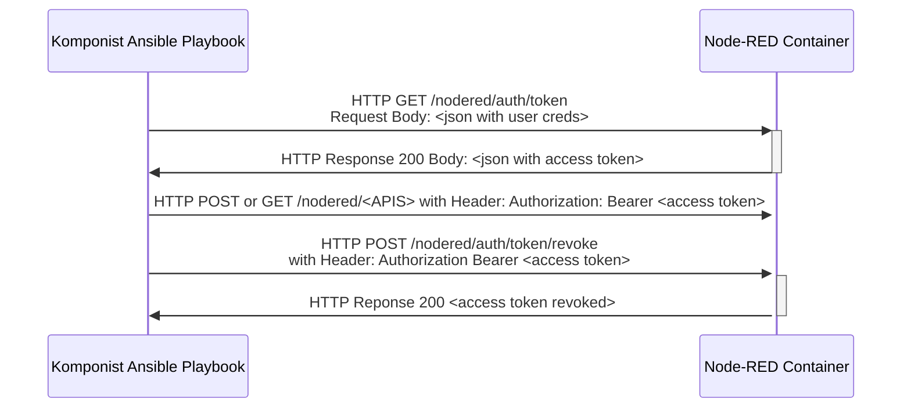
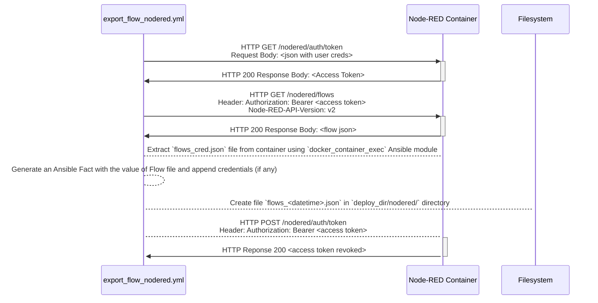
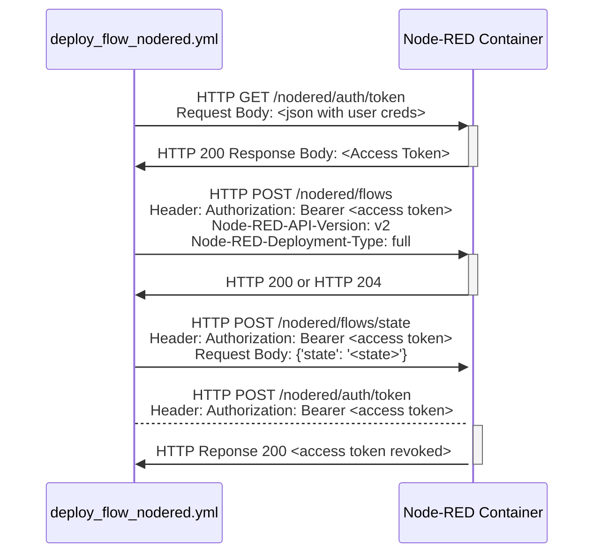
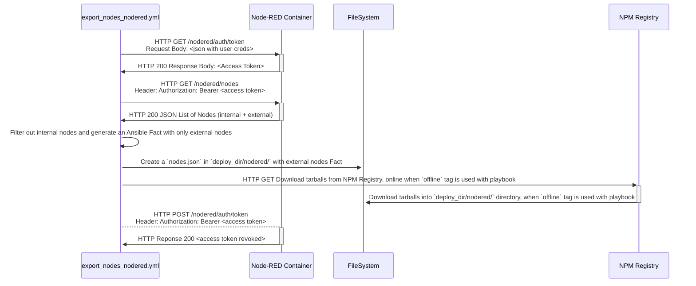
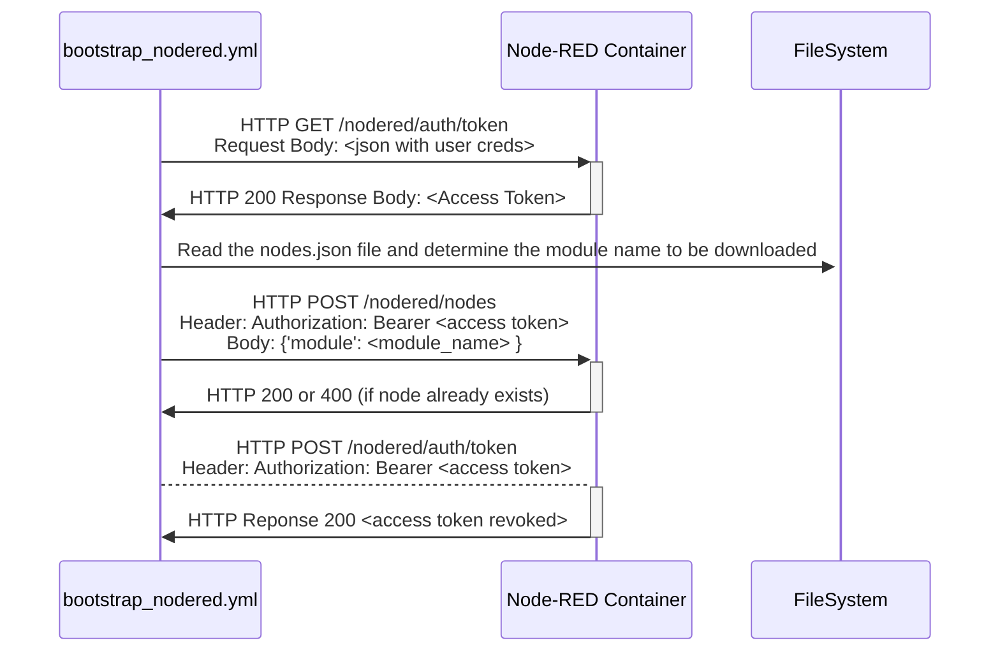
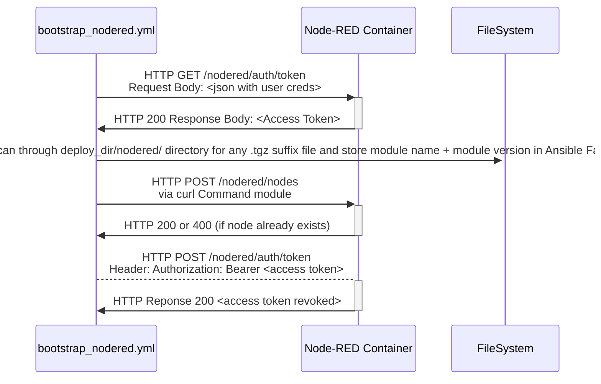

# Node-RED Container in Komponist

This document describes the interaction and necessary design decisions of executing Komponist
related playbooks with the Node-RED container deployed via Komponist's `generate_stack.yml`.

## Security

Node-RED within Komponist is provisioned by applying the set of credentials provided in a 
`creds.yml` Ansible variables file to generate the `bcrypt` encrypted passwords into the
`nodered/settings.js` file.

The set of credentials are used to secure the Node-RED editor UI as well as Node-RED Admin APIs.

> Only credentials that have `*` privileges are used to interact with the Node-RED Admin API.

Using the all-privileged user credentials, all of Komponist's Ansible Playbooks interact initially
with the Node-RED Admin API to obtain an __Access-Token__ which is further used to achieve certain
tasks and at the end of each playbook the tokens are revoked. As a common rule, every Node-RED
related playbook starts by obtaining the all-privileged user credentials, and obtains an Access Token
for further interaction with Node-RED and at the end of the playbook revokes this token.

The following sequence diagram describes the interaction of authentication + authorization in a 
playbook:



## Exporting / Deploying / Controlling Node-RED Flows

This section describes how Komponist's Ansible Playbook handle the export / deploy logic for
Node-RED flows.

### Flows and Credentials

Node-RED's design by default lets a user export the current flow as a JSON file but will not 
display the credentials of Node-RED nodes within the flow as plain-text values for good measures.

One caveat that this design decision poses is when the exported flow file is deployed on a different
node-RED instance, the flow may not work correctly since the credentials of the nodes are missing.
The user has to manually adapt the values by visiting the Editor UI and then starting the flow.
This can be tedious when deploying the same flow on multiple devices.

There is a way to obtain credentials of nodes in a safe manner. These credentials exist in a file
called `flows_cred.json` file under the `/data` directory within the running node-RED container.
This file is created __if and only if__ there are nodes in a flow which have credentials where the user
initially has fed the values in them whilst working on flow.

Based on Node-RED documentation for [Flows Admin API][1] updating an exported flow with the value of 
the `flows_cred.json` and deploying such an updated flow will be able to cover the caveat previously
mentioned. However, this brings one to another caveat.

The values from the `flows_cred.json` file are encrypted with a key. If this key is not fixed to a certain
user-specific value then each Node-RED instance generates a random key and encrypts the credentials accordingly.
Since each key on each Node-RED instance is random, deploying a flow with credentials encrypted on one instance
will not work for another instance.

In order to be able to deploy a flow developed locally to multiple Node-RED instances in a network, each of 
these instances has to be configured with the same key to make the decryption of credentials possible and
the flow work as intended. This is achievable by setting the `credentialSecret` to a user-specific value in
the `settings.js` file on all deployed Node-RED containers.

This feature is implemented as an _OPTIONAL_ configuration the `creds.yml` file. If the user add a value
to the `credential_secret` key for Node-RED, the respective `settings.js` file is created with the value
set to the `credentialSecret` key in the file. Upon bringing the container up, any future flows with nodes
that have credentials configured in them will be encrypted with the user-specific key and the exported flow
file with credentials in them is deployable on multiple Node-RED instances with the same configuration.

### Flow State

Starting from v3.x Node-RED it is possible to control the state of a Flow i.e., whether it is started or stopped.
In order to achieve this functionality, the `runtimeState` value in the `settings.js` should be enabled.
This configuration is enabled by default in Komponist.

Once a flow is uploaded, Komponist Ansible Playbook to deploy the flow can explicitly control the flow state,
post successful deployment. This is achieved via `/flows/state` Admin API from Node-RED.

### Playbooks

The following playbooks are developed in Komponist:

| Playbook | Purpose |
|:---------|:--------|
| `export_flow_nodered.yml` | Playbook to export the current flow from the local Node-RED instance |
| `deploy_flow_nodered.yml` | Playbook to deploy a dedicated flow to a Node-RED instance |

Descriptions for these playbooks are described further below.

#### Export a Flow from Node-RED via `export_flow_nodered.yml`

The playbook, upon execution, will generate a `flows_<datetime>.json` in the `deploy/nodered/` directory.
This is assuming the `deploy_dir` variable in `config.yml` has not been changed, if it has then the playbook
generated the `flows_<datetime>.json` in the `custom/deploy/dir/path/nodered/` directory.

Usage:

```bash
ansible-playbook export_flow_nodered.yml --ask-vault-pass
```

with custom configuration files

```bash
ansible-playbook export_flow_nodered.yml -e "@path/config.yml" -e "@path/creds.yml" --ask-vault-pass
```

The functionality of the playbook is illustrated using the following sequence diagram:



The structure of the generated JSON file is as follows:

```json
{
    "credentials": {
        "$": "<encrypted_credentials_hash>"
    },
    "flows": [ // node-red nodes
    ]
}
```

#### Deploy a Dedicated Flow to Node-RED via `deploy_flow_nodered.yml`

This playbook, upon execution, will deploy a dedicated JSON Flow file to Node-RED container.

Usage:

```bash
ansible-playbook deploy_flow_nodered.yml -e "flow_file=path/to/flows.json" -e "flow_state=start"
```

will deploy the `flows.json` existing in in `path/to` directory and start the flow upon successful upload.

Default state of flow is __stopped__. Rationale for this decision is that once the flow is deployed a user may
wish to check flow via Editor UI before letting it run.

The `flow_state` extra variable in the CLI can be used to override the state to deploy and start.

The functionality of the playbook is illustrated using the following sequence diagram:



## Exporting / Importing Node-RED Nodess

This section describes how Komponist's Ansible Playbooks handle the export / import
Node-RED nodes that are part of a Flow.

### Importing Nodes Online

Node-RED instances during development maybe connected to the public internet, whereby
users can essential download specific nodes, via the __Palette Manager__ in the Editor UI.

Node-RED generally downloads the nodes from the global NPM Registry as internet connectivity
is available. In situations where multiple Node-RED containers have to be bootstrapped / provisioned
with the existing nodes, having to go into each Node-RED Editor UI and downloading them 
via the __Palette Manager__ is not feasible.

There needs to be a way to export a _manifest_ of any external nodes running on the local instance.
Upon parsing this manifest of external nodes, Komponist can install the nodes via the Node-RED
Admin API. The Komponist Ansible Playbooks for exporting nodes extracts the information like the 
external Nodes modules name and version and prepare a manifest called `nodes.json`.

This file is further used to bootstrap other Node-RED instances in an automated fashion.

### Importing Nodes Offline

In situations where the flows need to deployed in an air-gapped environment
(partial to no internet connectivity), having to deploy flows with no prior installation of 
nodes will cause the flows not to work. In such air-gapped environments since there
is not connectivity to the public internet, pulling nodes via the NPM Registry is also
not possible.

In such scenarios the _gzipped_ tarballs of the nodes need to be downloaded prior to
deployment. In many cases, node-RED specific nodes are always deployed on the NPM Registry
so downloading the tarballs is possible during the development phase where internet connectivity
is available and deploying / bootstrapping node-RED instances in air-gapped instances is 
then possible when pushing these tarballs to the `/nodes` Admin API.

The downloaded tarballs are stored in `deploy_dir/nodered/` directory and the Playbook
will scan through the directory for any potential `.tgz` files and upload them to the
Node-RED instances via __HTTP POST__ on `/nodes`.

### Playbooks

The following playbooks developed in Komponist:

| Playbook | Purpose |
|:---------|:--------|
| `export_nodes_nodered.yml` | Playbook to export the existing external nodes from a Node-RED instance as a manifest or tarballs |
| `bootstrap_nodered.yml`    | Playbook to bootstrap / provision / import external nodes to a Node-RED instance online / offline |

#### Export External Nodes via `export_nodes_nodered.yml`

This playbook interacts with the Node-RED Admin API and obtains the nodes information.
Depending on whether an explicit Ansible Tag is mentioned (`offline`) the respective tarballs
of the nodes are downloaded (atleast tried) from the NPM Registry.

Usage:

```bash
ansible-playbook export_nodes_nodered.yml
```

This will generate a `nodes.json` file in `deploy_dir/nodered/` directory.

In order to explicitly also download the external nodes' tarballs

```bash
ansible-playbook export_nodes_nodered.yml --tags offline
```

This will downloaded all the tarballs under `deploy_dir/nodered/` directory with
the format

    <node-module-name>-<node-module-version>.tgz

The functionality of the playbook is illustrated using the following sequence diagram:



#### Import / Bootstrap Node-RED with External Nodes via `bootstrap_nodered.yml`

This playbook interacts with the Node-RED Admin API and uploads the external nodes
needed in a Node-RED instance either online (via NPM Registry) when explicitly 
mentioned via Ansible Tags `online` or via offline tarballs
when explicitly mentioned via Ansible Tags `offline`

Usage:

```bash
ansible-playbook bootstrap_nodered.yml --tags online
```

will parse through the `nodes.json` file and install the external nodes via the Internet

```bash
ansible-playbook bootstrap_nodered.yml --tags offline
```

will boostrap Node-RED instance via the offline tarballs existing in the `deploy_dir/nodered`
directory.

The functionality of the playbook is illustrated using the following sequence diagram when used with `online` Ansible Tag:




The functionality of the playbook is illustrated using the following sequence diagram when used with `offline` Ansible Tag:




[1]: https://nodered.org/docs/api/admin/methods/post/flows/
